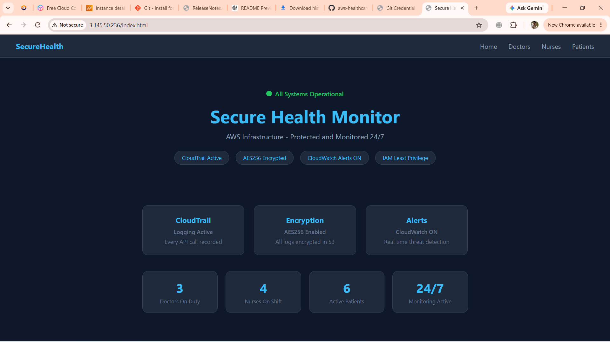
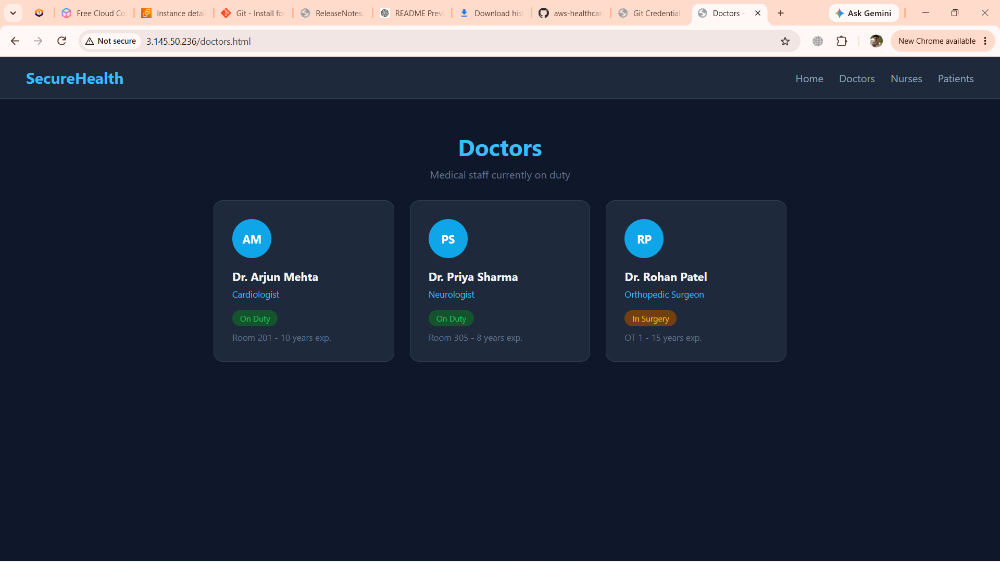
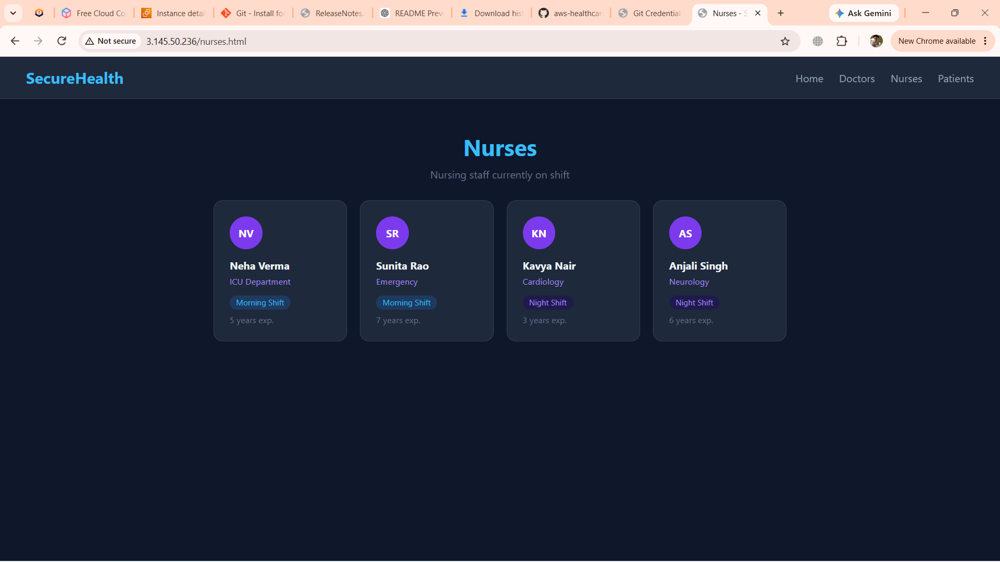
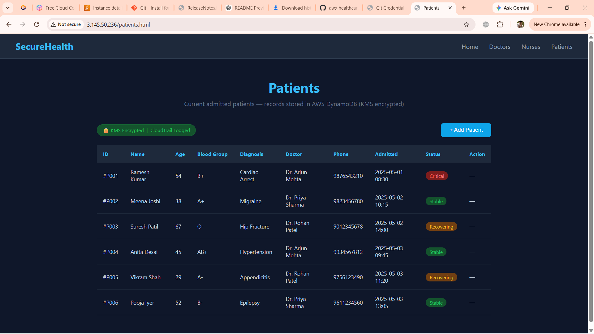

# AWS Healthcare Infrastructure Automation with Terraform

## Overview
This project automates the deployment of a healthcare application's cloud infrastructure on AWS using Terraform (Infrastructure as Code). It provisions a secure, monitored environment with centralized logging and alerting.

## Project Screenshots

### Home Page



### Doctors Page



### Nurses Page



### Patients Page



## Architecture
- **VPC** – Isolated network environment for the application
- **EC2** – Compute instances hosting the application
- **IAM** – Role-based access control for secure permissions
- **CloudWatch** – Centralized monitoring and metrics
- **CloudTrail** – Security logging and audit trail
- **SNS** – Real-time security and operational alerts

## Tech Stack
- **Terraform** – Infrastructure as Code
- **AWS** (EC2, VPC, IAM, CloudWatch, CloudTrail, SNS)
- **Bash** – Instance provisioning scripts


## Project Structure

```text
aws-healthcare-infra-terraform/
├── main.tf
├── vpc.tf
├── ec2.tf
├── iam.tf
├── cloudwatch.tf
├── cloudtrail.tf
├── variables.tf
├── outputs.tf
├── userdata.sh
├── README.md
├── website/
├── bootstrap/
└── admin-dashboard/
```

## Features
- Automated, repeatable infrastructure provisioning
- Centralized monitoring and logging
- Real-time security alerting via SNS
- Environment separation (dev/staging/prod)

## How to Deploy
1. Clone this repository
2. Configure your AWS credentials
3. Create a `terraform.tfvars` file with your own values (see `variables.tf` for required inputs)
4. Run:
```bash
terraform init
terraform plan
terraform apply
```

## Author
**Aniket Thakur** – Aspiring Cloud & DevOps Engineer
[LinkedIn](https://www.linkedin.com/in/aniket-thakur-848617313)
